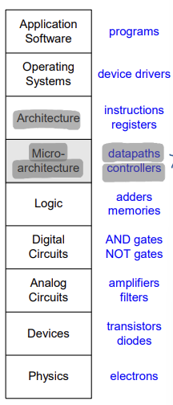

## Lecture 10. Single-Cycle MIPS \# 1

# Introduction

**Microarchitecture**: the CPU internal hardware structure, which of course understands machine code and is able to execute it.

`Micro-architecture = datapaths + controllers`

Multiple microarchitectures for an ISA

- Single-cycle: 한 사이클에 명령어 한 개 실행
- Pipeline: 한 사이클에 여러 개의 명령어 실행 가능

# Revisiting...

## Performance

CPU Time..? 진도 거꾸로 나가서 모르겠음 

## Digital Logic Design Basics

- **Combinational logic** (조합 회로): Output is directly determined by **current input**; 현재의 입력에만 의해 출력 결정

- **Sequential logic** (순차 회로): Output is determined not only by **current input**, but also **internal state** (i.e., **previous inputs**); 현재 입력 + state에 의해 출력 결정

  - Sequential logic needs state elements to store information: **Flip-flops** and **latches** are used to store the state information. But, avoid using latch in digital design

    > Flip-flop(FF)은 edge triggered: 1->0 or 0->1 의 찰나에만 update -> 동기화에 더 유리
    >
    > latch는 FF와 반대로 level sensitive 하기 때문에 update 구간이 길어 동기화에 불리
    >
    > => 보통 FF 사용

## State Element

Registers (implemented with flip-flops) store data in a circuit

# Control unit

- ALUSrc: rd2 or imm 중에 뭘 ALUsrc로 보낼까
- RegWrite: 레지스터 파일에 쓰기 작업을 할것인지
- MemWirte: 메모리에 쓰기 동작을 할것인지
- MemToReg

## Execution of the arithemetic and logical instructions

R-type: rd에 write, src2가 rt

I-type: rt에 write, src2가 imm

- RegWirte = 1: ALU의 결과값을 무조건 reg에 저장

- ALUSrc: ALU의 src2 결정 (src1는 rs로 고정)
  - ALUSrc = 0: rd2
  - ALUSrc = 1: imm

## Execution of the memory access instructions

- `lw		$rt, imm($rs)`
  - 
