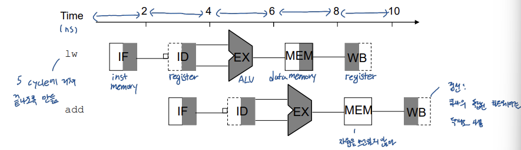
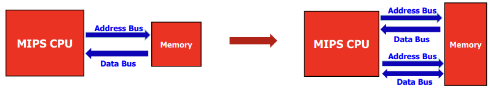
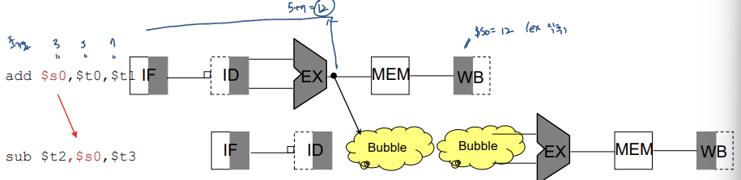
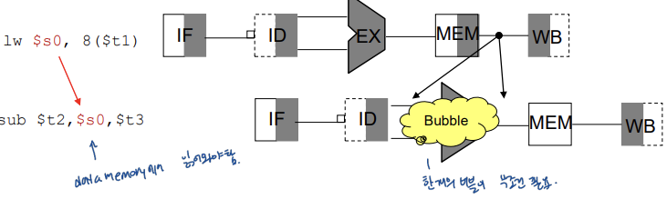
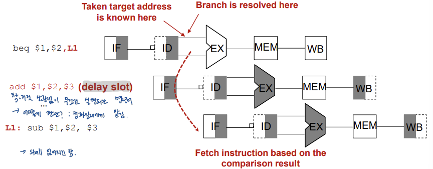
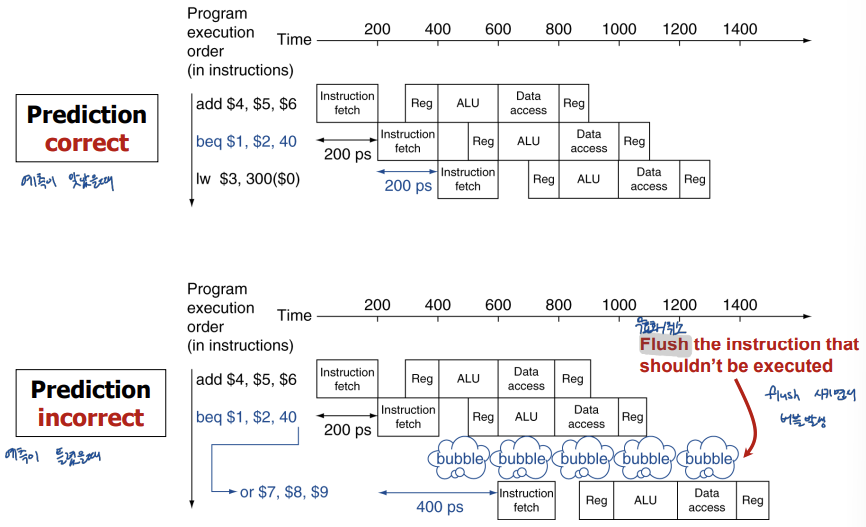

## *12. Pipline MIPS 1*

# Pipeline design

pipelining은 throughput을 증가시켜 성능을 항샹시킨다. 명령어 하나를 5개의 실행 단계로 쪼개어, 여러 개의 명령어를 병렬로 처리할 수 있다.

**IF**: Instruction fetch -> **ID**: Instruction decode / register file read -> **EX**: Execute / address calculation -> **MEM**: Memory access -> **WB**: Write back

회색부분이 사용중인 하드웨어 유닛이다. 레지스터를 읽을 때는 왼쪽 부분만 칠해져 있고, 쓸 때는 오른쪽 부분만 칠해져 있다. 한 사이클 안의 시간을 반으로 나눠서 사용한다는 의미이다.

# Hazards

pipeling이 항상 완벽하게 동작할 수 있다. datapath를 분할하여 쓰고 있기 때문에 충돌이 일어날 수 있다. 이때 hazard가 발생하여 다음 사이클에 다음 명령어가 실행하지 못하게 된다.

Hazard에는 세 가지의 type이 있다.

- **Structure hazards:** 동시에 같은 하드웨어를 쓰려고 할 때 발생한다.
- **Data hazard:** 같은 데이터에 대해 명령어를 연달아 사용하는 경우 데이터 연산 순서가 어긋나게 될 때  발생한다.
- **Control hazard:** branch 여부를 결정하느라 다음 instruction이 뭔지 모를 때 발생한다.

# Structure Hazards

IF stage와 MEM stage가 동시에 동작할 때 메모리를 동시에 사용하게 된다. 이때 stall되지 않도록 CPU와 메모리 사이에 addr bus와 data bus를 따로 만들어서 해결한다.

# Data Hazard

같은 데이터를 연달아 접근할 때, 앞의 명령어에서 계산한 결과를 바로 다음 스테이지에 적용할 수 없게 되므로 **Forwarding** 기법을 사용해 계산되자마자 다음 명령어가 실행되는 부분으로 데이터값을 넘겨버린다.

forwarding하면 위 그림에서 버블이 없어지게 된다.

하지만 forwarding으로 항상 stall을 피할 수 있는 것은 아니다. **Load-Use case**에서는 어쩔 수 없이 한 번의 stall이 일어나게 된다. lw에서 MEM 단계 이후에 값을 불러올 수 있기 때문이다.

코드 작성 순서 자체를 바꾸면 stall을 없앨 수도 있다. Load-use case에서는 load 부분을 앞으로 몰아넣고 use 부분을 최대한 뒤로 미루면 stall이 없어질 수도 있다.

# Control Hazard

Branch의 실행 여부는 ID stage 이후에 알 수 있다. 따라서 그 이후에 다음 명령어를 execute 할 수 있다. 

- **Delay Slot:** 어쩔 수 없이 생기는 nop을 막기 위해 그 자리에 branch의 여부와 상관없이 무조건 실행되는 명령어를 넣는다. 그 자리를 delay slot이라고 하고 branch가 발생하든 안하든 delay slot에 위치한 명령어는 무조건 실행된다. 컴파일러가 알아서 처리한다.

  

- **Branch Prediction:** **stall penalty**를 막기 위해 틀리는 것을 감수하더라도 branch 여부를 예측한다. 일단 실행시키고 만약 예측이 틀렸을 경우 현재 파이프라인에 들어있는 명령어들을 flush 시킨다. 패털티가 크기 때문에 예측 정확도가 매우 높아야 유의미한 결과를 만들어낸다.

  