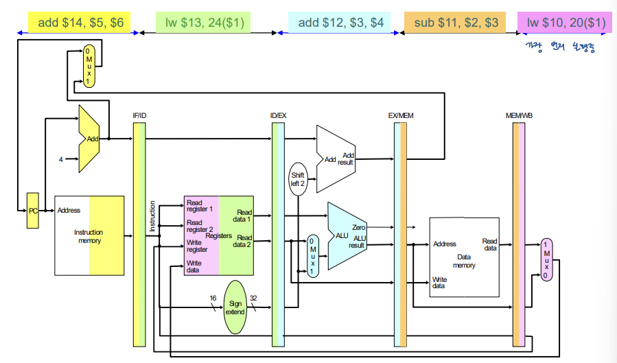
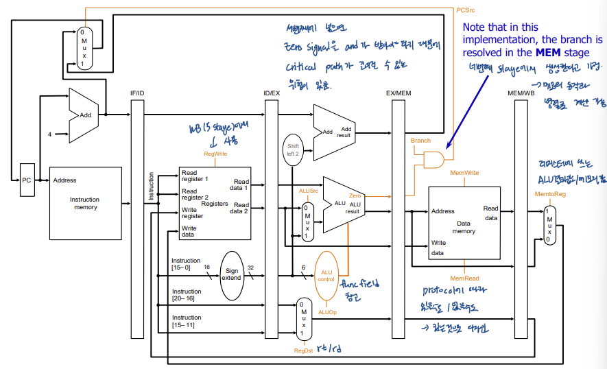

## *13. Pipeline MIPS 2*

# Pipelined Datapath

pipeline을 적용하여 프로세서를 5개의 stage로 나타내면 위 그림과 같다. 각 stage에서는 그림의 색칠된 부분을 사용하고 있다. 각 스테이지마다 중간에 있는 길쭉한 pipeline register들이 현재 스테이지에서의 결과값을 다음 스테이지로 넘겨준다. 

# Pipeline Control

datapath에 control 신호들을 꽂아주면 위 그림과 같이 나타내어진다.이 그림은 forwarding과 hazard detection을 고려하지 않은 schemetic이다.

