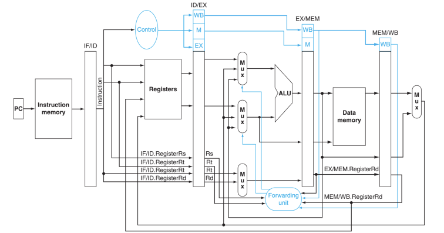
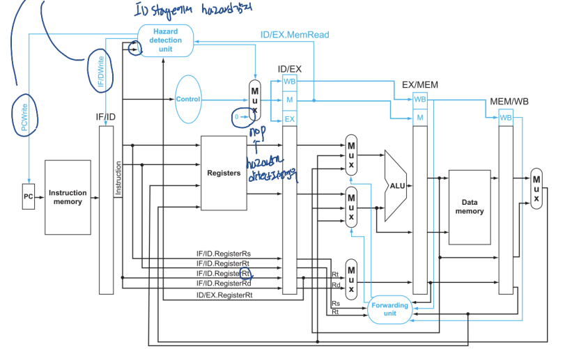

## *14. Pipeline MIPS 3*


# Forwarding: Forwarding Unit

register file이 write back 될 때 까지 기다리지 말고, 파이프라인 레지스터를 이용하여 temporary result를 넘긴다. 이를 위해서는 forwarding unit과 몇 개의 mux가 필요하다. 



data hazard는 두 가지 경우로 나눌 수 있고, 다음과 같이 forwarding한다.

- **EX hazard:** EX의 결과값을 저장한 Rd가 ID에서 사용중인 Rs나 Rt와 겹칠 경우. 즉 ALU의 실행 결과를 바로 다음 명령어에서 src로 사용해야 할 경우

  ```
  if (EX.MEM.RegWrite
  and (EX/MEM.RegisterRd != 0)
  and (EX/MEM.RegisterRd = ID/EX.RegisterRs)) ForwardA = 10
  
  if (EX.MEM.RegWrite
  and (EX/MEM.RegisterRd != 0)
  and (EX/MEM.RegisterRd = ID/EX.RegisterRt)) ForwardB = 10
  ```

  다음 cycle의 EX stage에서 ALU의 src로 바로 이전의 ALU 결과값을 가져온다.

- **MEM hazard:** 메모리에서 가져온 값인 Rd가 ID에서 사용하는 Rs나 Rt와 겹칠 경우. 즉 load한  값을 바로 다른 명령어에서 src로 사용해야 할 경우

  ```
  if (MEM/WB.Regwrite
  and (MEM/WB.RegisterRd != 0)
  and (MEM/WB.RegisterRd = ID/EX.RegisterRs)) ForwardA = 01
  
  if (MEM/WB.Regwrite
  and (MEM/WB.RegisterRd != 0)
  and (MEM/WB.RegisterRd = ID/EX.RegisterRt)) ForwardB = 01
  ```

  다음 cycle의 EX stage에서 ALU의 src로 바로 이전에 메모리에서 로드되어 WB stage로 간 값을 src로 불러온다.


# Stalling: Hazard Detection Unit

**Load-Use case**에서는 forwarding을 하더라도 한 개의 stall이 발생할 수 밖에 없다. stall이 발생함을 감지하는 것이 hazard detection unit이다. hazard detection unit은 ID stage에서 hazard를 감지한다.

hazard detection unit의 output인 PCWrite와 IF/IDWrite가 0일 경우 stall된다.



```
if (ID/EX.MemRead and
((ID/EX.RegisterRt = IF/ID.RegisterRs) or
(ID/EX/RegisterRt = IF/ID.RegistersRt)))
  stall the pipeline
```

