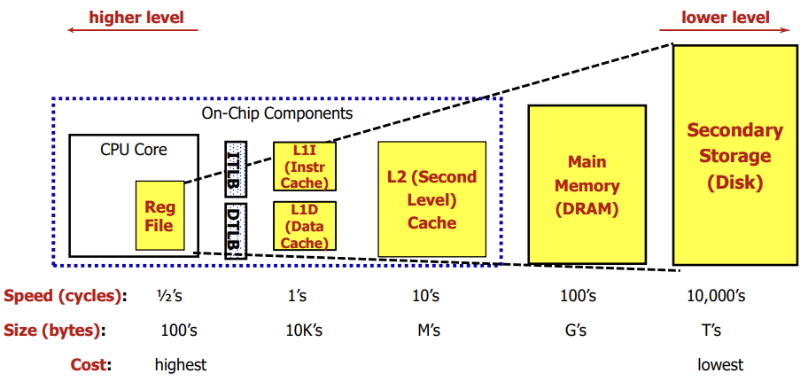

## *Lecture 15. Cache 1*

# Memory Hierarchy

L1 Cache: 최대한 빠르게 사용하기 위해 디자인됨

- private: core당 분리되어 있음
- I / D: instruction용과 data용이 분리되어 있음

L2 Cache: 필요에 따라 선택적으로 메모리 사용 위해 디자인됨

- shared: core0, core1이 모두 사용 가능
- Unified: I / D 구분없음

SRAM: used to design chache

- 6 transisters / cell -> 크고 빠름: 저장 단위가 크다는 것이지, 전체적인 캐시 크기는 메모리보다 훨씬 작음

DRAM: used for main memory

- 1 transister and 1 capacitor / cell -> 작고 느림

# Cache Operation

- size of cache <<<<< size of main memory

- caches: principle of locality의 장점을 취함
  - Temporal Locality: 가장 최근에 접근한 데이터는 또 쓸 가능성이 높으니까 캐시에 저장해놓음
  - Spatial Locality: 현재 사용하는 데이터의 근처 데이터도 쓸 가능성이 높으니까 데이터 근처에 있는 것까지 덩어리로 가져옴 -> cache line 단위로 가져옴

# Cache Terminology

- **Block (or cache line)**: 캐시가 데이터를 저장하는 단위
- **Hit**: 요청한 데이터가 캐시에 있을 경우 hit라고 함
  - Hit rate: 요청한 데이터가 캐시에 있는 비율
  - Hit time: 캐시에 접근해서 요청한 데이터를 꺼내오는데 걸리는 시간
- **Miss**: 요청한 데이터가 캐시에 없을 경우 miss라고 함
  - Miss rate: 요청한 데이터가 캐시에 없는 비율. 1 - Hit rate
  - Miss penalty: 캐시에 없는 데이터 블럭을 메모리까지 가서 갖고 오는데 걸리는 시간

#  Direct-mapped Cache

Mapping to cache

- Index: (block address) MOD (\# of blocks in the cache)

Cache structure: Valid + Tag + Data + (Dirty)

- Valid-bit: 유효한 데이터이면 1
- Data: 실제 저장할 데이터
- Tag: 메모리의 어느 블럭에서 왔는지 (메모리 블록 주소에서 index의 상위 비트들이 tag)
- Dirty-bit: 캐시에서만 데이터가 업데이트된 상황이라면 1 (캐시에 저장된 값과 메모리에 저장된 값이 불일치)

# Handling Writes

- read miss: 데이터를 memory -> cache -> CPU로 갖고 오면 됨. 캐시 무조건 연동됨.
- write miss: 선택지가 있음
  - write miss가 발생했을 때 캐시 연동 여부
    - write-allocate: 캐시에 블록을 가져와서 씀. 캐시와 연동.
    - write-no-allocate: 캐시에 블럭을 가져오지 않고 메모리에 바로 씀
  - 쓰기 동작 할 때 메모리 업데이트 타이밍
    - write-back: 캐시에만 업데이트해놨다가, 해당 블럭이 빠져나갈 때 dirty-bit가 1인 것을 확인하고 메모리 업데이트
    - write-through: 캐시와 메모리 동시에 업데이트시킴
- write-allocate -> write-back policy
  - write hit: 캐시에만 write하고 dirty-bit = 1 세팅
  - write miss: 캐시로 블록 가져와서 캐시에만 데이터 업데이트시키고 dirty-bit = 1 세팅
- write-no-allocate -> write-through
  - write hit: 캐시와 메모리 동시에 업데이트
  - write miss: 캐시 블록 가져오지 않고 메모리에만 접근해서 업데이트

