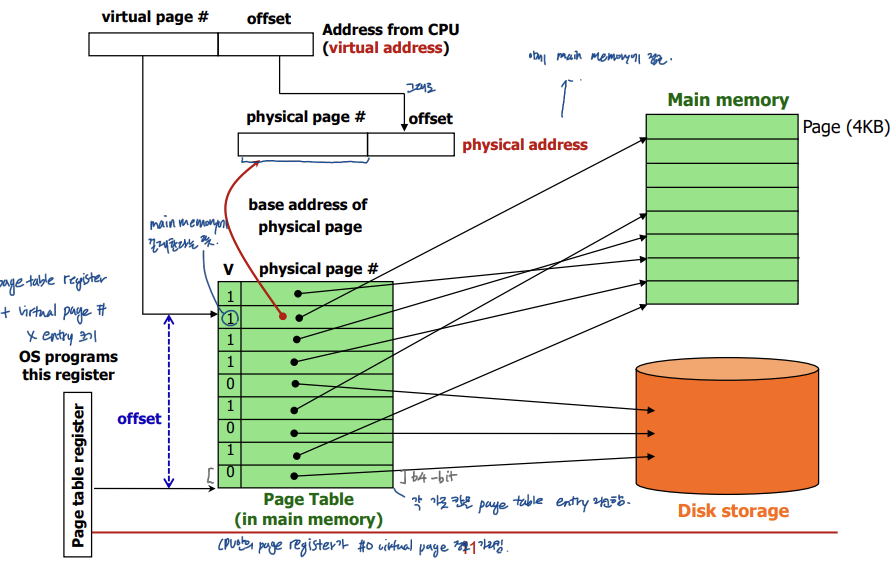

## *17. Virtual Memory 1*

physical memory <-> virtual memory

VM은 main memory를 사용하고 secondary storage를 캐시로 사용

- **pages:** virtual space가 나눠진 fixed-sized blocks. 보통 4KB
- **page fault**: virtual memory miss. cache miss와 비슷하게 보면 됨.
- **page table**: os가 page table을 만들어 주소를 번역한다. page table은 main memory안에 위치한다.

# Page Tables

OS가 각 프로세스마다 page table을 만든다. page table은 page table entries (PTEs)로 구성되어 있고, PTE는 virtual page number와 인덱싱 되어 있다. CPU 안의 page table register가 main memory 안의 page table을 가리킨다.

- requested page가 메인 메모리에 있는 경우, PTE는 physical page number와 그 주변의 것들을 저장한다.
- requested page가 메인 메모리에 없는 경우(page fault), PTE는 swap space를 참조한다.

