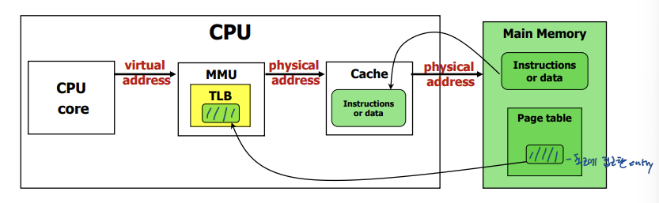
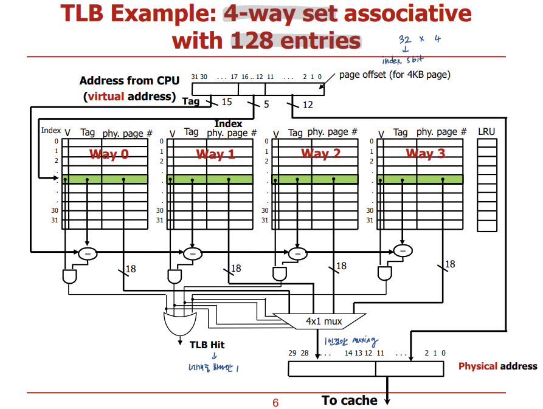
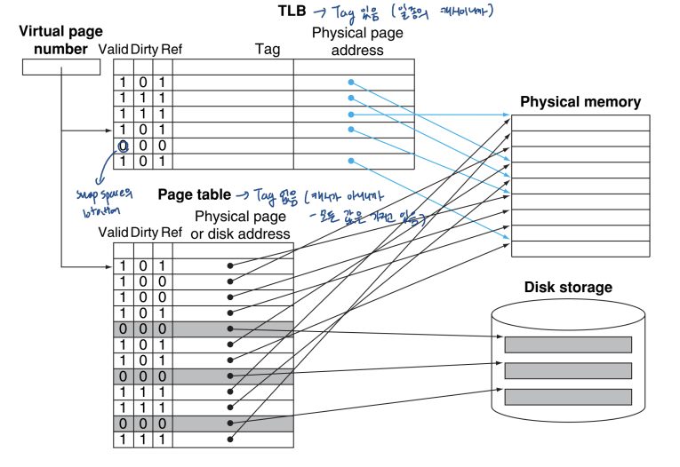

## *18. Virtual Memory 2*

# Translation Lookaside Buffer (TLB)

메모리에 접근할 때마다 메인 메모리에서 page table을 참조하는 것은 비효율적이니까, page table에 대한 캐시인 TLB를 만들었다. TLB는 CPU안에 있으며, 최근 접근한 physical page number를 저장하고 있다.

- TLB: a cache for page table
- Cache: a cache (?) for instruction and data

# TLB Structure

virtual address size: 32-bit, physical address size: 30-bit 라고 가정

page 크기는 보통 4KB = 212B 이기 때문에 page offset은 12-bit이다. 캐시에서 계산한 방법과 똑같이 set 크기 구해서 index 길이 파악한 후, virtual addr에서 하위 12-bit는 page offset, 그다음 하위 (index 길이)-bit는 index, 나머지 상위 비트는 Tag로 나눈다. 

physical addr에서 하위 12-bit는 virtual addr의 page offset을 그대로 사용하고, 나머지 상위 비트들은 TLB가 번역한 값으로 채운다.

TLB는 write-back cache.이므로 dirty-bit가 세팅되어 있다. 특정 페이지에 접근하면 ref-bit=1로 세팅한다.

# TLB Terminology

- TLB hit: VA -> PA 바로 교환
- TLB miss: 두 가지 상황이 있다.
  - Merely TLB miss: 페이지 정보가 메인 메모리의 page table에 있는 경우, 그 정보를 그대로 TLB로 올려주면 된다.
  - Page fault: 메인메모리의 page table에 정보가 없다. (valid = 0) 이 경우에는 하드 디스크까지 가서 가져와야 한다. page fault는 OS가 처리한다.

