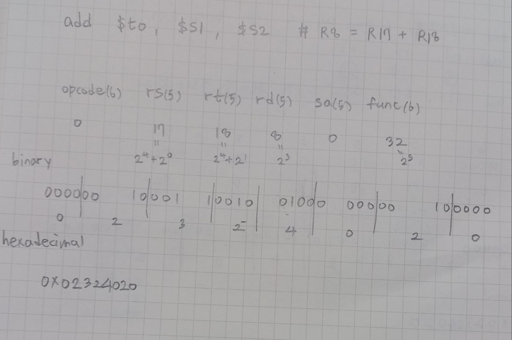
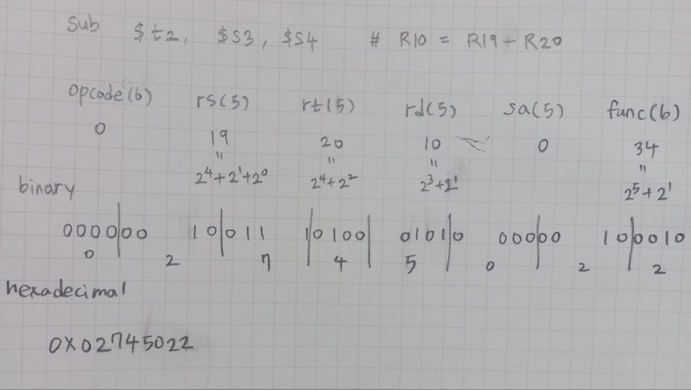

## Lecture 2. MIPS Instructions \# 2


# Levels of Program Code

## High-level Language

*High-level language program in C*

Level of abstraction closer to problem domain: 추상화가 잘 되어있어서 인간의 관점에서 생산하기 좋음

Provides productivity and portability: 다양한 CPU에서 돌아간다 (해당 언어의 컴파일러가 있다면)

## Assembly language

*C Compiler: one-to-many -> Assembly language program (MIPS)*: 1대 다 컴파일 (컴파일러에 따라 다른 어셈 언어로 번역됨)

textual and symbolic representation of instructions: Human-readable form

특정 ISA에서 굴러감: CPU 종류가 달라지면 안돌아감 (MIPS는 MIPS CPU에서만 돌아감)

## Machine Code (object code or binary)

*Assembler: one-to-one -> Machine (object, binary) code (MIPS)*: 1대 1 컴파일

Binary bits of instructions and data: Machine-readable form 컴퓨터에 저장되고 실행될때 사용되는 데이터


# MIPS Instructions

MIPS의 instruction category: 물론 assembly language 

- Arithmetic, Data transfer, Logical, Conditional branch, Unconditional jump -> 이번 쳅터에서 하나씩 배움


# Register File in Verilog

```plain
module regfile(input clk, // 1-bit
			  input we,	// write enable: 5-bit
               input [4:0] ra1, r2, wa, // addr: 5-bit
               input [31:0] wd, // write word: 32-bit
               output [31:0] rd1, rd2); // read word: 32-bit

reg [31:0] rf[31:0];

// three ported register file
// read two ports combinationally
// write third port on rising edge of clock
// register 0 hardwired to 0
 
// write
always @(posedge clk)	// clk이 posedge 일때만 실행
    if (we) rf[wa] <= wd;	// write enable이 1일 때, wd를 rf[ra]에 assign  
// read: 0번 reg가 아닐 때만 데이터 쓰기 실행
assign rd1 = (ra != 0) ? rf[ra1] : 0;
assign rd2 = (ra2 != 0) ? rf[ra2] : 0;
    
endmodule
```


# MIPS Instruction Fields

MIPS Instruction은 32-bit 크기고, 하나의 instruction은 다음과 같은 구성으로 이루어져 있음 (명령어 format에 따라 조금씩 달라짐) -> 이게 R format

> op	rs	rt	rd	shamt	funct

| 별명  | size   | 가리키는 것                                                |
| ----- | ------ | ---------------------------------------------------------- |
| op    | 6-bits | **op**code that specifies the operation: 명령어 지정1      |
| rs    | 5-bits | **r**egister of the first **s**ource operand: src1         |
| rt    | 5-bits | **r**egister of the second source operand (s 다음 t): src2 |
| rd    | 5-bits | **r**egister of the result's **d**estination: dst          |
| shamt | 5-bits | **sh**ift **am**oun**t** (for shift instructions)          |
| funct | 6-bits | **funct**ion code augmenting the opcode: 명령어 지정2      |


# add

R format instruction: opcode, rs, rt, rd, sa, func

`add  rd, rs, rt`

`add $t0, $s1, $s2  # %t0 <= $s1 + $s2`




# sub

R format instruction: opcode, rs, rt, rd, sa, func

`sub  rd, rs, rt`


