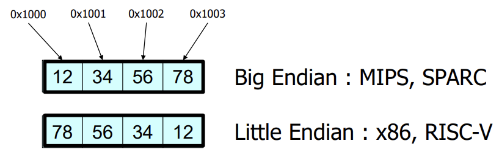
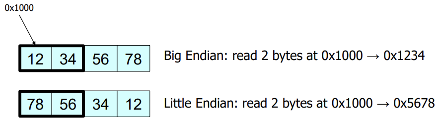
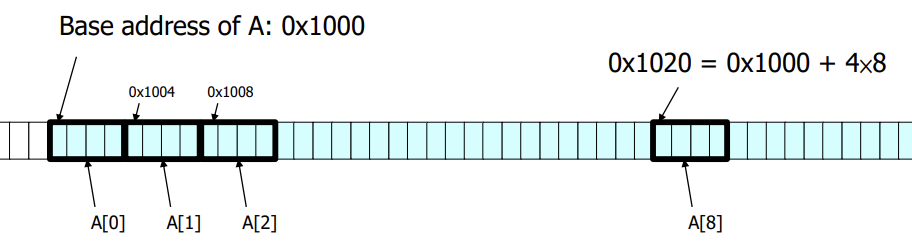
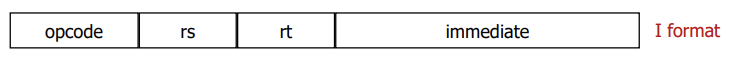
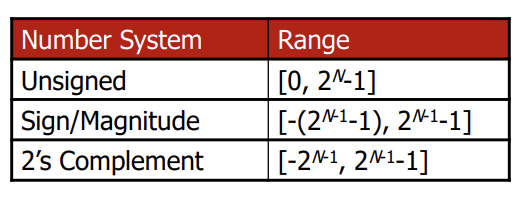
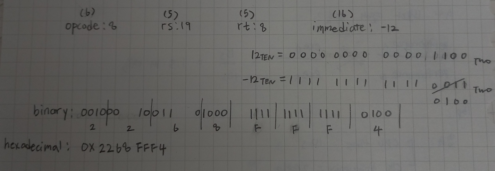
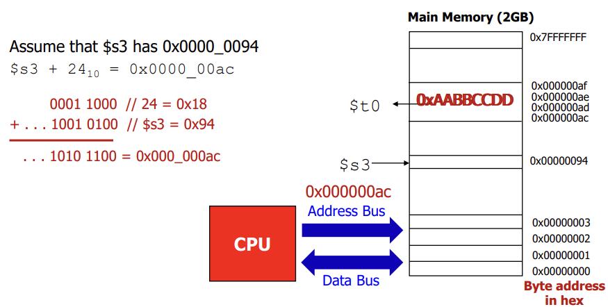

## Lecture 3. MIPS Instructions \# 3

# Data Transfer Instructions

CPU has a limited number or registers inside: 레지스터가 32개 밖에 없으니까

Thus, MIPS (and all other CPUs) must provide instructions that transfer data between memory and registers: 메모리에 있는 값 갖다 쓰는 명령어가 필요함

- Such instructions are called **data transfer instructions**
- To access data in memory, the data transfer instruction should supply the **memory address**

data transfer 명령어는 메모리 주소가 필요함


# Memory Operands

To apply arithmetic operations

- Load values from memory into registers: 메모리에서 레지스터로 불러오고
- Store result from register to memory: 레지스터에 저장된 값을 메모리로 옮김

Memory is **byte addressed**: 주소가 할당된 공간의 크기는 1-byte (8-bit)

Words are aligned in memory: Address must be a multiple of 4; 4 byte 크기인 word를 할당하려면 주소는 4의 배수가 되어야 함

**Mips is Big Endian**

- Most-significant byte at least address of a word: MSB가 낮은 주소에 위치
- c.f. Little Endian: least-significant byte at least address

## Memory addressing

1byte (8-bite): 메모리 주소는 1byte단위로 지정됨; 16진수로 표현

## Word alignment

Address must be a multiple of 4 for ..

- **lw** (load word) and **sw** (store word) instructions

  > lw나 sw를 위해서는 메모리 주소를 알아야 함: 모두 word 단위로 읽고 쓰기 때문에 주소도 4의 배수여야 함
  >
  > 0x1000을 가져오라(무조건 4의 배수여야 함) = 0x1000 ~ 0x1003 까지 가져오라

# Endianness

What happens if store this 4-byte value to address 0x1000 ?



- **Big Endian** MSB가 시작 주소(base addr)로 감
- **Little Endian**: LSB가 시작 주소(base addr)로 감

If you always store / load 4 bytes at a time at 4-byte aligned addresses, endianness does not matter: It matters when you read in smaller sizes; 4byte보다 작은 크기를 읽어들일 때 문제가 됨




## Memory Operand Example 1

C code: 

```
g = h + A[8];  // g in $s1, base address of A in $s
```



Compiled MIPS code:

```
lw	$t0, 32($s3)	# load word: Index 8 requires offset of 32 (4-byte per word)
add	$s1, $s2, $t0
```

## Memory Operand Examaple 2

C code:

```
A[12] = h + A[8];	// h in $s2, base address of A in $s3
```

Compiled MIPS code:

```
lw	$t0, 32(%s3)	# load word
add %t0, %s2, %t0
sw	%t0, 48(%s3)	# store word
```


# Immediate Operands

Adding the constant 4 to register $s3 (using lw and add):

```
lw	$t0, AddrConstant($s1)	 # $t0 = constant 4
add	$s3, $s3, $t0		    # $s3 = $s3 + $t0
```

Alternative: constant data specified in an instruction; 상수 영역 포함되어있는 명령어

```
addi	$s3, $s3, 4		  # $s3 = $s3 + 4
```

No subtract immediate instruction: Just use a negative constant: 음수 상수를 사용하면 되기 때문에 subi는 없음

```
addi	$s2, $s1, -1	# $s2 = $s1 - 1
```


# I-format

- **R-format** instructions have all 3 operands in registers: R-format은 매개변수 3개를 모두 레지스터에서 가져옴

- In **I-format** instructions, one operand can be stored in instruciton itself: I-format 명령어 안에 상수 하나가 저장되어 있음
  - They are called **immediates** because they are immediately available from the instructions
    - They do not require a register or memory access: 상수 필드에 있는 값은 레지스터나 메모리에 접근 없이 바로 읽어들일 수 있다.
    - 16-bit immediate field in MIPS instructions limits values to the range of (-2<sup>15</sup> ~ 2<sup>15</sup>-1) since it uses 2's complement: immediate field의 크기는 16비트이고, 2의 보수 체계를 사용하기 때문에 나타낼 수 있는 범위는 -2<sup>15</sup> ~ 2<sup>15</sup>-1
  - func field가 따로 없기 때문에, opcode만으로 명령어 결정됨



## Revisiting 2's Complement Number

- In hardware design of computer arithmetic, the 2's complement number provides a convenient and simple way to do addition and subtraction of **unsigned and signed numbers**: 2의 보수 체계는 부호 있는 수와 부호 없는 수의 덧셈과 뺄셈 간단하게 가능

- Given an n-bit number N in binary, the 2's complement of N is defined as

  ​	**2<sup>n</sup> for N ≠ 0**

  ​	**0 for N = 0**

- A fast way to get a 2s complement number is to **flip all the bits and add 1**

  - example: N = 0011 --(flip)--> 1100 --(add 1)--> 1101


## Number System Comparison with N-bit



- 16-bit  (N = 16) can represent a range of
  - Unsigned: [0, +(2<sup>16</sup>-1)] = [0, +65535]
  - Sign/Magnitude: [-(2<sup>16-1</sup>-1), +(2<sup>16-1</sup>-1)] = [-32767, +32767]
  - 2's complement: [-2<sup>16-1</sup>, +2<sup>16-1</sup>-1] = [-32768, +32767]


# addi

- I format instruction

  `addi	rt, rs, imm`

- Example:

  ```
  addi	$t0, $s3, -12	# %t0 = %s3 + (-12)
  ```

  


# lw

- `lw` reads a word (32-bit) from memory and loads into a register

- I format Instruction

  `lw	 rt, address`

- Example:

  ```
  lw	%t0, 24(%s3)	# $t0 <= [$s3 + 24]
  ```




## lw (Cont)

- The memory address (32 bit address) is formed by adding the contents of the **base address** to the **offset**: 주소는 base address + offset으로 나타냄
  - The immediate specified in an instruction is a 16-bit 2's complement number in the range [-2<sup>16-1</sup>, +2<sup>16-1</sup>-1] = [-32768, +32767]: offset을 나타내는 immediate의 범위는 16bit (2의 보수1)


# sw

- `sw` stores (writes) a word (32-bit) from a register to main memory

- I format instruction

  `sw  rt, address`

- Example:

  ```
  sw	$t2, 8($s3)	# [$s3 + 8] <= $t2
  ```
