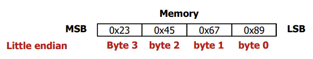

## Lecture 4. MIPS Instructions \# 4


# The Constant Zero

- MIPS register 0 (%zero) is the constant 0: 0번 레지스터는 상수 0; read only

- Useful for common operations

  - move between registers

    ```
    add	$t2, $s1, $zero		# $t2 = $s1
    ```

  - Loading immediate value

    ```
    addi	$t2, $zero, 10		# $t2 = 10
    ```

    

# Why Should CPU Access Memory?

- Initially, everything (your code and data) is stored in main memory (hard-disk)

  > hard-disk / flash에 있는 데이터는 전원을 꺼도 남아있음 (비휘발성 메모리)

- CPU should access (read/write) main memory to execute your program

  > 프로그램이 실행되기 위해서는 데이터가 main memory에 올라와야 함; CPU는 오직 main memory에 접근 가능함

- So, 2 purposes

  - **Instruction read:** CPU reads instructions from memory

  - **Data read / write:** CPU reads data from memory and writes data to memory


# Instruction Access (Read)

- **Program Counter (PC):** Every CPU has a special register that keeps track of the current instruction's address in execution: PC 레지스터에 실행해야 할 명령어의 주소가 저장되어 있음 
  - MIPS의 CPU 안에는 32-bit 크기의 PC 있음
  - PC is initialized with a predefined address at reset: PC는 reset시 특정 값으로 초기화됨
  - Then, PC gets changed as (or after) each instruction gets executed: 순차적으로 진행되는 경우 PC값은 1 cycle에 +4씩 커짐; instruction이 4-byte 크기이기 때문

## Instruction Access Illustration


> PC값이 Address Bus를 타고 이동하면 메모리의 해당 주소에 있는 instruction이 Data Bus를 타고 CPU로 전달됨. 

## Data Transfer Illustration


> 명령어 읽어올 때, 명령어 처리 할 때 Data bus 이용
>
> PC값은 명령어가 순차적으로 진행할 시 4씩 증가


***

# Word

- Word is a term of the natural unit of data used by a particular computer design: 컴퓨터 디자인에 따라 다른 word 단위 가짐
  - A word is simply a fixed-sized group of bits that are handled together
  - The number of bits in a word is an important characteristics of a computer architecture: word의 크기는 컴퓨터 구조의 특성에 큰 영향을 미침
- The word size of MIPS is 32 bits (4 Bytes): MIPS에서는 32bit
- Alignment restriction: the memory address of a word must be on natural word boundaries (a multiple of 4 in MIPS-32): 메모리 주소도 word 크기의 배수

## Memory Address


# Loading and Storing Bytes

- byte단위로도 메모리 읽고 쓰기가 가능하다
- byte-addressable instructions in MIPS: `lb`, `lbu`, `sb`

# lb

- `lb` reads a byte (8-bit) from memory and loads into a register: 1 바이트를 읽어들임

- I format instruction

  `lb  rt, address`

- Example:

  ```
  lb	$t0, 1($s3)		# $t0 <= [$s3 + 1]
  ```

## lb - Where to Loaded and How?

- Byte is loaded into the LSB (Least Significant Byte) of the register `$t0` and sign extended: register의 LSB쪽으로 load시키고, 앞부분은 sign-extension 시키겠다; 2의 보수 취급

  

  - If you don't wont to have it sign-extended, use the `lbu` (`Load byte unsigned`) instruction: `lbu`는 sign extension 안시킴; `zero extension`	

# sb

- `sb` writes a byte (8-bit) to memory from a register: 레지스터로부터 8바이트를 메모리에 작성

- I format instruction

  `sb  rt, address`

- Example:

  ```
  sb	$t0, -7($s3)	# [$s3 + (-7)] <= $t0
  ```

## sb - Where to Stored and from Where?

- `sb` takes the byte from LSB of a register and write it to a byte in memory: 레지스터의 가장 왼쪽 값(LSB)를 write한다
  - It does not change the other bits in a word in memory (no sign-extension!) : 메모리 크기는 1 byte로 고정되어 있기 때문에 extension 같은건 안함; 여유공간 따위 없음


# Endianness

- Big-endian: 주소를 MSB부터 매김 (MSB가 작은 주소)
- little-endian: 주소를 LSB부터 매김 (LSB가 작은 주소)


