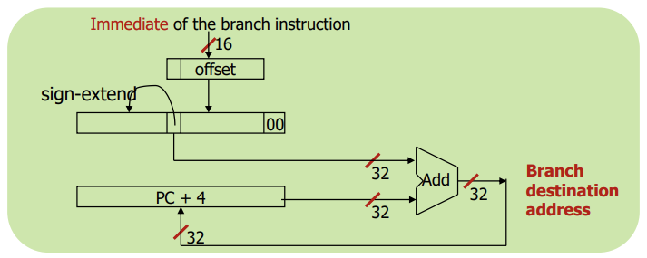
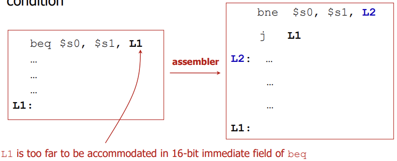

## Lecture 6. MIPS Instructions \#6


# Why Branch?

high level 언어에서 if/else, case, while, loops는 순차적이지 않은 순서로 진행하게 함. 이때 PC이  skip됨. (평소에는 4씩 증가하다가 branch 신호를 받으면 입력받은 주소로 skip)

- **Conditional branch** instructions (조건부 분기) perform a test and branch only if the test is true: 조건 값이 참일 때만 분기
  - `beq`: branch if equal, `bne`: branch if not equal
- **Unconditional branch** instructions (무조건 분기) always branch: 해당 명령어 만나면 무조건 분기
  - `j`: jump, `jal`: jump and link, `jr`: jump register


# beq, bne

- I format instruction

  `beq (bne)  rs, rt, lable`

- Examples:

  ```
        bne	$s0, $s1, skip	# go to "skip" if $s0 ≠ %s1
        beq	%s0, %s1, skip	# go to "skip" if $s0 = $s1
  ...
  skip: add   $t0, $t1, $t2
  ```

## Branch Destination Address

- `beq`, `bne`는 i-type: immediate field 크기는 16bit; 32bit인 절대주소가 들어갈 수 없음

  - Branch instructions use the immediate field as offset: 상수 필드를 offset으로 사용함
  - Offset is relative to the PC: offset은 PC의 상대적 주소

- Branch destination calculation

  - PC gets updated to  PC+4 during the fetch cycle so that it bolds the address of the next instruction: fetch되는 동안 PC값은 PC+4로 대기타고 있음

  - It limits the branch distance to a range of -2<sup>15</sup> ~ (+2<sup>15</sup>-1) instructions from the instruction after the branch instruction: imm 필드 크기만큼 이동에는 제한이 있음

  - AS a result, **destination = (PC + 4) + (imm << 2)**

    > base: 원래의 다음 PC값; PC+4
    >
    > offset: 명령어 개수 x 4 (instruction은 한 개 당 32bit = 4byte)
    >
    > imm << 2: 곱하기 4 & sign-extend




# In Support of Branch

대소 비교해서 분기

```
slt 	rd, rs, rt	// Set on less than (R format)
sltu	rd, rs, rt	// Set on less than unsigned (R format)
slti	rt, rs, imm	// Set on less than immediate (I format)
sltiu	rt, rs, imm	// Set on less than unsigned immediate (I format)
```

## Branch Pseudo Instructions

- `blt`, `ble`, `bgt`, `bge`: pseudo instructions for signed number

  - The assembler uses a reserved register (`$at`) when expanding the pseudo instructions: 어셈블러가 `$at` 레지스터에 세팅해서 pseudo inst 확장함
  - MIPS compilers use `slt`, `slti`, `beq`, `bne` and the fized value of 0 (`zero`) to create all relative conditions (equal, not equal, lessthan, less than or equal, greater than, greater than or equal)

- `blt`: branch if less than; *"기준!"*

  ```
  blt $s1, $s2, Label			# branch if $s1 < $s2
  	slt	$at, $s1, $s2		# if $s1 < $s2 then $at = 1
  	bne	$at, $zero, Label	# if $at ≠ 0 then branch
  ```

- `ble`: branch if less than or equal to; `bgt`의 여집합

  ```
  ble	$s1, $s2, Label			# branch if $s1 ≤ $s2
  	slt	$at, $s2, $s1		# if $s2 < $s1 then $at = 1
  	beq	$at, $zero, Label	# if $at = 0 then branch
  ```

- `bgt`: branch if greater than; `blt`와 비교 순서 반대

  ```
  bgt	$s1, $s2, Label			# branch if $s1 > $s2
  	slt	$at	$s2, $s1		# if $s2 < $s2 then $at = 1
  	bne	$at, $zero, Label	# if $at ≠ 0 then branch
  ```

- `bge`: branch if greater than or equal to; `blt`의 여집합

  ```
  bge	$s1, $s2, Label			# branch if $s1 ≥ $s2
  	slt	$at, $s1, $s2		# if $s1 < $s2 then $at = 1
  	beq	$at, $zero, Label	# if $at = 0 then branch
  ```

  

## Bounds Check Shortcut

check if 1 ≤`x` < y (index out of bounds for arrays)

```
sltu	$t0, $x, $y		# if x < y than t0 = 1
					   # if x >= y  or x < 0 than t0 = 0
beq		$t0, $zero, IOOB	# if t0 = 0 than IOOB(index out of bounds)
```


# j, jr, jal

- Unconditional branch instructions: 무조건 분기

  ```
  j	target		// jump (J-format)
  jal target		// jump and link (J-format)
  jr	rs			// jump register (R-format)
  ```

- J-format: opcode(6-bits) + jump target(26-bits)

- **destination = {(PC+4)[31:28], jump target, 2'b00}**

  > 상위 4bit는 PC+4 유지
  >
  > 하위 28bit는 jump target << 2; instruction은 4byte 단위이므로 두 칸 옮겨줌
  >
  > 
  >
  > J-format의 offset은 I-format의 offset보다 훨씬 범위가 넓으므로, 건너뛰려는 범위가 너무 넓을 경우 조건을 한 번 뒤집고 무조건 분기로 멀리 떨어진 주소를 명시 (어셈블러가 해줌)


