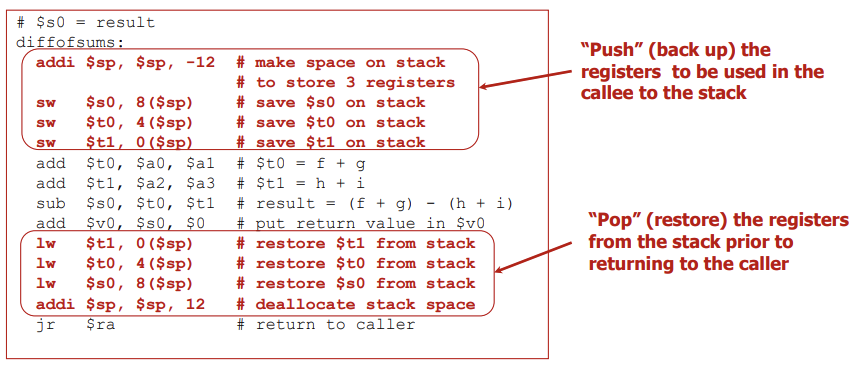
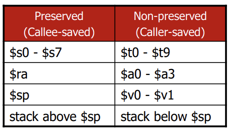

## Lecture 7. MIPS Instructions \#7


# Procedure (Function)

- `$a0 - $a3`: 4개의 argument registers
- `$v0 - $v1`: 2개의 value registers (to return)
- `$ra`: return address register (31번)


# jal

- **caller가 사용:** Procedure call instruction (J- format)

  ```
  jal	ProcedureAddress	# link and jump
  					   # $ra <- pc + 4 ...link
  					   # pc <- jump target ...jump
  ```

- arguments are passed via `$a0, $a1, $a2, $a3`

# jr

- **callee가 사용:** Return instruction (R-format)

  ```
  jr	$ra		# return (pc <- $ra)
  ```

- return results are store in `$v0, $v1`


# The Stack

spilling registers: stack은 높은 주소에서 낮은 주소로 쌓임 (`$sp`가 점점 작아지면서 공간이 확보됨)

`$sp ($29)`: the top of the stack (의 주소)

- **push:** add data onto the stack
  - `$sp = $s= - 4`: 접시 쌓을 공간 미리 만들고
  - Store data on stack at new: 새로 생긴 공간에 데이터 백업
- **pop:**
  - Restore data from stack at `$sp`: `$sp`에 담긴 데이터를 꺼내서 다시 저장하고
  - `$sp = $sp + 4`: 공간 다시 없앰



## Preserved and NonPreserved Registers

- caller는 preserved 레지스터를 자유롭게 사용 가능, 대신 non-preserved 레지스터를 사용할 경우 save and restore (register spilling) 처리해 줘야함
- 반대로 callee는 non-preserved 레지스터를 자유롭게 사용 가능, 대신 preserved 레지스터를 사용할 경우 save and restore (register spilling) 처리해 줘야함




## Nested Procedure Calls

- leaf procedures: 다른 함수를 호출하지 않는 함수


## Recursive Procedure Call

factorial: `$a0`에 n을 spill, `%ra`에 자기자신 주소를 spill (`$sp-8` 한 후 저장하고, 재귀함수 호출 후, stack에 저장된 값 불러오고 `$sp+8`한 후 `jr` )

