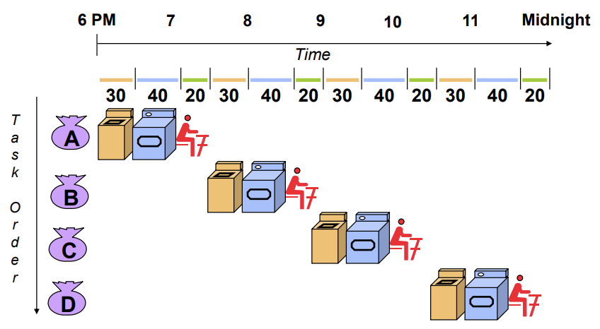
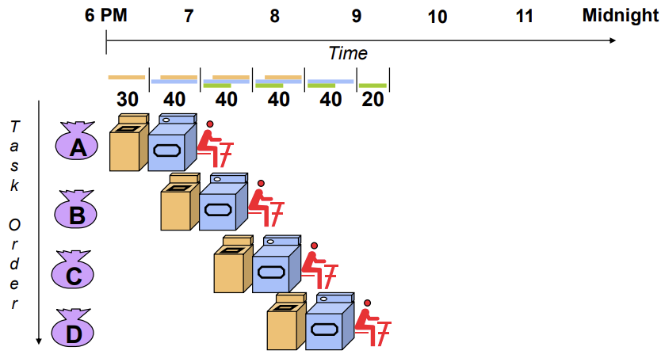
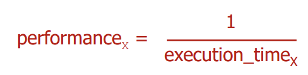
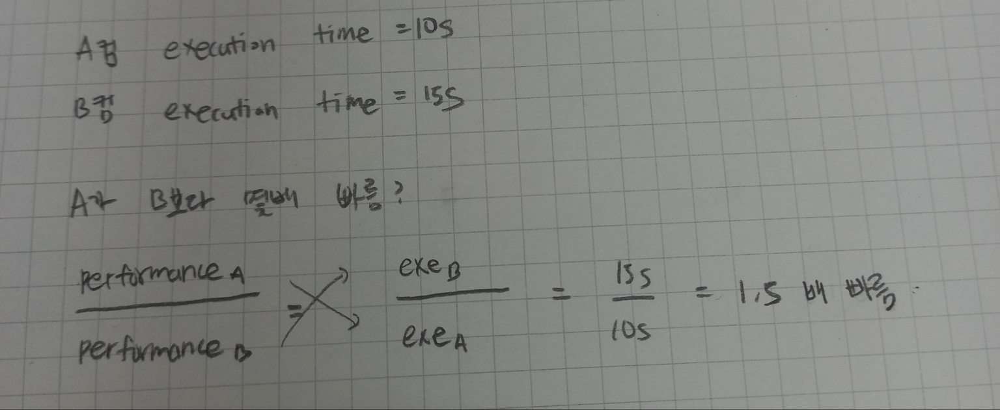
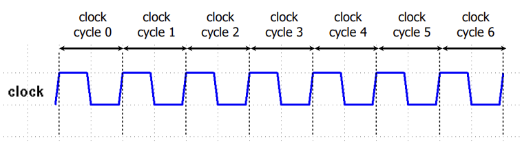
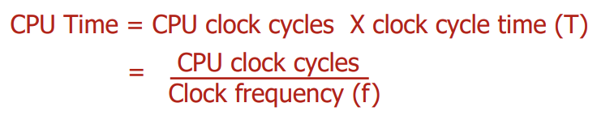
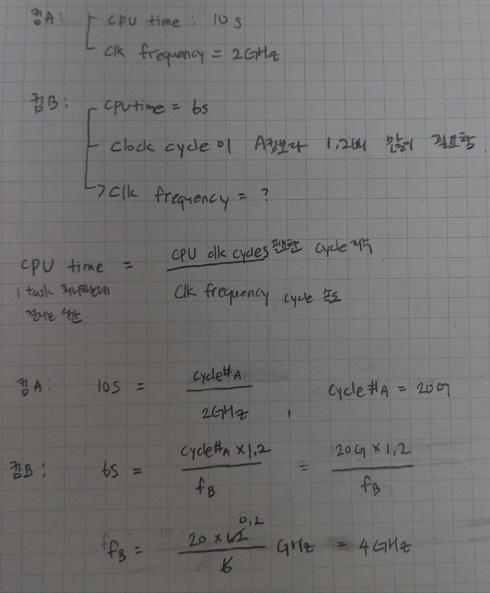

## Lecture 8. Performance

# Response Time Throughput

- How to measure performance of a computer?

  - **Response time (Execution time, Latency)**

    - Time between the *start and the completion* of a task
    - Important to individuals users
    - **Embedded computers** and **PCs** are more focused on response time

    > "한 개의 일"이 시작하고 끝날 때 까지 걸리는 시간
    >
    > 반응하는 시간: 각 개인이 각 task를 끝내는 시간

  - **Throughput**

    - Total number of tasks done in a given time: 주어진 시간에 몇 개의 일을 처리했느냐
    - Important to datacenter and/ore supercomputer managers
    - **Servers** are more focused on throughput: 서버는 response time보다 throughput이 중요

    > 여러 개의 일에 대한 처리 속도

- Need different performance metrics depending on machine types and/or usages

# Response Time and Throughput

- Laundry Example: 1개의 task = Washer: 30min + Dryer: 40min + Folder: 20min

## Sequential Laundry

현재 사용 중인 손님이 나간 후에 다음 손님 이용 시작

- Response time: `30min + 40min + 20min = 90mins`

  > 빨래방 손님 입장: 손님 한 명이 일을 끝내고 나가는데 걸리는 시간

- Throughput: `4 tasks / 6 hours = 0.67 tasks / hr`

  > 빨래방 주인 입장: 주어진 시간에 몇 명의 손님이 일을 처리하고 나갈 수 있느냐

## Piepelined Laundry

현재 손님이 특정 부품을 사용하는 일을 끝냈다면, 다음 손님은 현재 손님이 있는 중에도 그 부품으로 일을 할 수 있다.

- response time: `30min + 40min + 20min = 90mins`

  > 손님 개인의 입장에서는 바뀌는 것이 없다

- Throughput: `4 tasks / 3.5 hours = 1.14 tasks / hr`

  > 빨래방 주인 입장에서는 성능 향상
  >
  > pipeline의 시간은 제일 길게 걸리는 시간에 기준을 맞춘다(40분): hardware의 구동 시간에 균형을 맞춰야 throughput 향상 가능

## Pipelining Lessons

- Pipelining doesn't help latency (response time) of a single task: 개별 작업 시간(response time)에는 영향 안감

- Pipelining helps throughput of entire workload: throughput을 향상시킴

- Multiple tasks operating simultaneously: 여러 task가 동시에 진행

- Unbalanced lengths of pipeline stages reduce speedup: 하드웨어 시간의 균형을 맞춰야 함

- Potential speedup = \# of pipeline states = \# of hardwares: stage 개수 늘리면 더 많이 중첩시켜서 속도 빨라지게 할 수 있음 

  > 빨래방 예에서는 독립된 하드웨어가 3개여서 최대 3개를 중첩 가능
  >
  > 나중에 5개짜리 hardware로 디자인 예정

***

여기서부터는 **response time**에만 focus 해서 CPU의 성능을 생각해보자 (throughput 무시)

# Relative Performance

- To maximize performance of your computer, you want to **minimize execution time** (= response time) for a task: execution time (response time) 에만 집중해서 성능 보자
- execution time이 줄어들수록 컴퓨터의 성능이 좋은 것임

​	x 컴퓨터가 y 컴퓨터보다 n배 빠르다면 response time이 n배 빠른것이다

## Example

# Measuring Execution Time

- **Execution time** (elapsed time of wall-clock time) is measured in **seconds per program**
  - Total execution time includes all aspects: disk access, memory access, I/O activities, OS overhead: execution time은 CPU 외에도 다양한 요소의 시간을 포함해서 결정됨
  - It determines the system performance: execution time은 시스템 성능을 결정함 (앞에 나온 식에서처럼)
- **CPU time**
  - The time CPU spent processing a given job: CPU에서만 걸리는 시간
  - It does not include time spent waiting for I/O, or running other progrms: CPU이외에 것은 고려하지 않음

# CPU time

## CPU Clock

- Virtually all computers are constructed in **sync with a clock**: 컴퓨터는 클락과 싱크를 맞춰 일이 실행됨

  - Discrete time intervals are called **clock cycles**: 클락이 한 번 딸깍이는 시간이 한 clock cycle

  

  - **Clock period (T):** duration of a clock cycle: 한 clock cycle이 몇 초 걸리는지
  - **Clock frequency (f): **clock cycles per second (**1/T**): 1초 동안 clock cycle이 몇 번 동작하는지; 당연하게도 clock period의 역수임

## CPU Time

- Express CPU time in terms of clock

  

  > `CPU Time`: CPU가 한 task를 처리하는데 걸리는 시간
  >
  > ​	= `CPU clock cycles`: 한 task가 소모한 clock cycle 개수
  >
  > ​		 x `clock cycle time (T)` : 한 clock cycle이 걸리는 시간

- So, the performance is improved by

  - Reducing the number of clock cycles: task가 적은 clock cycle내에 끝내게 하거나
  - Increasing clock frequency: clock frequency를 늘려서 클락이 빠르게 딸깍이게 하자

## Example

# CPI

## \# Instructions and CPI

- The performance equation does not include any reference to the number of instructions needed to run a program: performance는 명령어 개수에 영향을 받지 않는다..????
- Since computer executes instructions to run programs, the execution time must depend on the number of instructions executed: execution time은 명령어들을 실행시키는데 걸리는 시간이기 때문에, 명령어 개수에 영향을 받음
- Execution time is the number of instructions executed multiplied bu the average time per instruction: 뭔소리지

**CPU Time = CPU clock cycles x clock cycle time (T)**

> `CPU Time`: CPU가 한 task를 처리하는데 걸리는 시간
>
> ​	= `CPU clock cycles`: 한 task가 소모한 clock cycle 개수
>
> ​		 x `clock cycle time (T)` : 한 clock cycle이 걸리는 시간

**CPU clock cycles = \# instructions x Avg.clock cycles per inst (CPI)** 

> `CPU clock cycles`: 한 task가 소모한 clock cycle의 개수
>
> ​	= `# instructions` : 한 task를 처리하는데 필요한 instruction 개수
>
> ​		x `Avg. clock cycle per inst (CPI)`: 한 instruction이 소모하는 사이클의 평균 개수

**CPU Time = \# insts x CPI x T = \# insts x CPI / f**  

> `CPU Time`: sec = (`# insts`: #insts ) x ()`CPI`: #cycles/inst ) x (`T`: sec/cycle )
>
> 위 식으로 CPU Time을 sec 단위로 계산 가능

# Performance Summary

- Instruction set architecture: instruction count, CPI, T(f)에 영향
- Microarchitecture: CPI, T(f)에 영향

