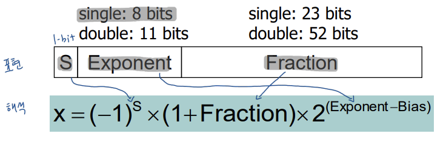

## Lecture 9. Floating Point

# Floating Point

single precision (32-bit)

s(1-bit): sign bit (0: 양수, 1: 음수):

exponent(8-bit): 실제 지수 + 127 (unsigned로 표현 위해)

- 실제 지수 = exponent - 127

fraction(23-bit): 000...00 (significand = 1.0) ~ 111...11 (significand = 2.0)

- 앞에 `1.` 이 항상 붙어있다고 생각

두 floating point를 더할 때는 지수를 낮은 쪽에 맞춰서 바꾸고 계산 후 normalize

# Floating-Point: 특수 용도

| Exponent           | Fraction | 의미                                                         |
| ------------------ | -------- | ------------------------------------------------------------ |
| 255(1로 채움)      | ≠0       | NAN                                                          |
| 255(1로 채움)      | 0        | +/- inf                                                      |
| 0 < exponent < 255 |          | 수치                                                         |
| 0                  | ≠0       | subnormal: (-1)s x (0.f)2 x 2-126 |
| 0                  | 0        | 0.0                                                          |

# Floating Point: OVerflow / Underflow

- Overflow (FP): A situation in which a positive exponent becomes too large to fit in the exponent field; exponent > 255
- Underflow (FP): A situation in which a negative exponenet becomes too large to fit in the exponent field; exponent < 0

